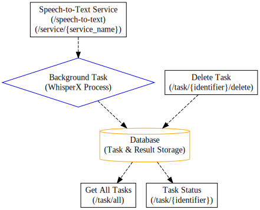

# whisperX REST API

The whisperX API is a tool for enhancing and analyzing audio content. This API provides a suite of services for processing audio and video files, including transcription, alignment, diarization, and combining transcript with diarization results.

## Documentation

Swagger UI is available at `/docs` for all the services, dump of OpenAPI definition is awailable in folder `app/docs` as well. You can explore it directly in [Swagger Editor](https://editor.swagger.io/?url=https://raw.githubusercontent.com/pavelzbornik/whisperX-FastAPI/main/app/docs/openapi.yaml)

See the [WhisperX Documentation](https://github.com/m-bain/whisperX) for details on whisperX functions.

### Language and Whisper model settings

- in `.env` you can define default Language `DEFAULT_LANG`, if not defined **en** is used (you can also set it in the request)
- `.env` contains defintion of Whisper model using `WHISPER_MODEL` (you can also set it in the request)

### Task management and result storage



Status and result of each tasks are stored in db using ORM Sqlalchemy, db connection is defined by enviroment variable `DB_URL` if value is not specified `db.py` sets default db as  `sqlite:///records.db`

See documentation for driver definition at [Sqlalchemy Engine configuration](https://docs.sqlalchemy.org/en/20/core/engines.html) if you want to connect other type of db than Sqlite.

#### Database schema

Structure of the of the db is described in [DB Schema](app/docs/db_schema.md)

## Getting Started

### Local Run

To get started with the API, follow these steps:

1. Create virtual enviroment
2. Install pytorch [See for more details](https://pytorch.org/)
3. Install whisperX

```
pip install git+https://github.com/m-bain/whisperx.git
```
4. Install the required dependencies:
```
pip install -r requirements.txt
```
5. Create `.env` file

define your Whisper Model and token for Huggingface
```
HF_TOKEN=<<YOUR HUGGINGFACE TOKEN>>
WHISPER_MODEL=<<WHISPER MODEL SIZE>>
```

6. Run the FastAPI application:

```
uvicorn app.main:app --reload
```
The API will be accessible at http://127.0.0.1:8000.

### Docker Build

1. Create `.env` file

```
HF_TOKEN=<<YOUR HUGGINGFACE TOKEN>>
WHISPER_MODEL=<<WHISPER MODEL SIZE>>
```

2. Build Image

using `docker-compose.yaml`

```sh
#build and start the image using compose file
docker-compose up
```


alternative approach

```sh
#build image
docker build -t whisperx-service .

# Run Container
docker run -d --gpus all -p 8000:8000 --env-file .env whisperx-service
```
The API will be accessible at http://127.0.0.1:8000.

#### Model cache

The models used by whisperX are stored in `root/.cache`, if you want to avoid downloanding the models each time the container is starting you can store the cache in persistant storage. `docker-compose.yaml` defines a volumne `whisperx-models-cache` to store this cache.

- faster-whisper cache: `root/.cache/huggingface/hub`
- pyannotate and other models cache: `root/.cache/torch`

## Related
- [ahmetoner/whisper-asr-webservice](https://github.com/ahmetoner/whisper-asr-webservice)
- [alexgo84/whisperx-server](https://github.com/alexgo84/whisperx-server)
- [chinaboard/whisperX-service](https://github.com/chinaboard/whisperX-service)
- [tijszwinkels/whisperX-api](https://github.com/tijszwinkels/whisperX-api)